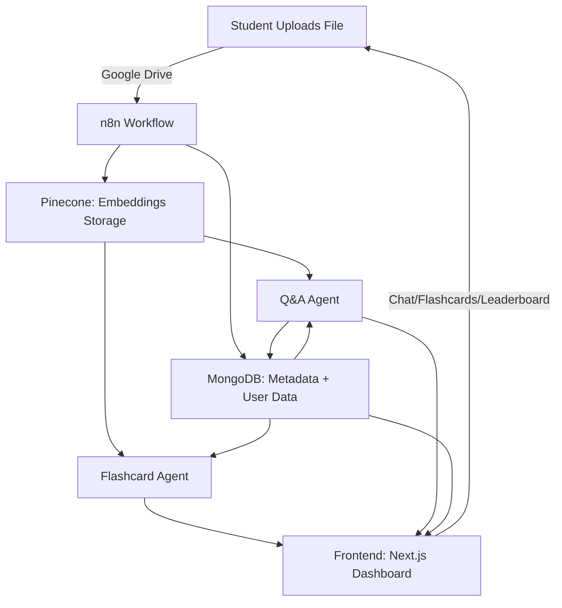

# 📚 StudyFlux – Personalized AI Learning Platform

[**▶ Live Demo: study-flux.vercel.app**](https://study-flux.vercel.app/)

**Contributors**
- [N1KH1LT0X1N](https://github.com/N1KH1LT0X1N)
- [vi800](https://github.com/vi800)
- [AstralKS](https://github.com/AstralKS)
- [MalayBhaveshPandya](https://github.com/MalayBhaveshPandya)

---

**StudyFlux** is a highly personalized AI-powered learning platform designed to make studying more interactive, engaging, and effective.
With **unique contextualization per user**, multilingual support, flashcards, live Q\&A, personalized dashboards, and leaderboards, StudyFlux adapts to each learner’s journey.

Built with a **scalable MERN + Next.js stack** and powered by **AI agents**, StudyFlux ensures students never lose context across sessions.

---

## 🚀 Key Features

* **🧠 Personalized AI Chatbot**

  * Learns from user history & previous conversations.
  * Provides contextual answers based on past performance.

* **🌍 Multilingual Support**

  * Chat, flashcards, and UI available in multiple languages.

* **📑 Flashcards + Adaptive Questions**

  * AI-generated flashcards from uploaded content.
  * Spaced-repetition algorithm for effective memorization.

* **📊 Personalized Dashboard**

  * Track learning progress, scores, and activity.
  * Compare performance via **leaderboards**.

* **📝 Conversation Summarization**

  * Every interaction is summarized & stored for future sessions.
  * Keeps personalization alive long-term

* **📂 File → Flashcards/Q\&A Workflow**

  * Upload files (Google Drive support).
  * AI extracts key concepts → flashcards + quiz-ready Q\&A.

---

## ⚙️ Technical Stack

### **Frontend (Student-facing)**

* **MERN + Next.js**
* **Next.js** → SSR/SSG for SEO & performance.
* **React** → Interactive UI (flashcards, leaderboards, dashboards).
* **UI Features** → Personalized dashboards, multilingual toggle, live chat.

### **Backend (APIs + Business Logic)**

* **Node.js (Express)** → API handling.
* **AI Integration: Gemini 2.5 Pro** → Core reasoning + conversation generation.
* **Workflow Orchestration: n8n** → Service automation & pipeline execution.

### **Data Layer**

* **MongoDB** → Stores user profiles, scores, progress, conversation summaries.
* **Pinecone (Vector DB)** → Stores embeddings of conversations & files for semantic search.
* **MongoDB Vector Search** → Alternative for embeddings storage & quick retrieval.

### **AI Agents**

1. **Flashcard Agent** → Adaptive flashcard generation (via Pinecone vector search).
2. **Q\&A Agent** → Contextual answering, difficulty adapts to student’s profile.
3. **Conversation Summarizer** → Summarizes chats → stored in MongoDB.

---

## 🔄 Workflow Example (File → Flashcards/Q\&A)

1. **Student uploads file** (Google Drive).
2. **n8n workflow triggers**:

   * Extracts file → sends embeddings to Pinecone.
   * Metadata registered in MongoDB.
3. **Flashcard Agent** generates adaptive flashcards.
4. **Q\&A Agent** fetches data from Pinecone + convo history → answers queries.
5. **Conversation Summarizer** logs structured summaries in MongoDB.

---

## 🏗️ System Architecture



---

## 📂 Project Structure

```
StudyFlux/
└── ./
    ├── app
    │   ├── (auth)
    │   │   ├── reset-password
    │   │   │   └── page.tsx
    │   │   ├── signin
    │   │   │   └── page.tsx
    │   │   ├── signup
    │   │   │   └── page.tsx
    │   │   └── layout.tsx
    │   ├── (default)
    │   │   ├── layout.tsx
    │   │   └── page.tsx
    │   ├── api
    │   │   └── hello
    │   │       └── route.ts
    │   ├── css
    │   │   ├── additional-styles
    │   │   │   ├── theme.css
    │   │   │   └── utility-patterns.css
    │   │   └── style.css
    │   ├── dashboard
    │   │   ├── components
    │   │   │   ├── Chat.css
    │   │   │   ├── Chat.jsx
    │   │   │   ├── FileUpload.jsx
    │   │   │   ├── Header.jsx
    │   │   │   ├── Loader.css
    │   │   │   ├── Loader.jsx
    │   │   │   ├── Summary.css
    │   │   │   └── Summary.jsx
    │   │   ├── App.css
    │   │   ├── App.jsx
    │   │   ├── index.css
    │   │   └── page.tsx
    │   └── layout.tsx
    ├── components
    │   ├── ui
    │   │   ├── footer.tsx
    │   │   ├── header.tsx
    │   │   └── logo.tsx
    │   ├── cta.tsx
    │   ├── features.tsx
    │   ├── hero-home.tsx
    │   ├── modal-video.tsx
    │   ├── page-illustration.tsx
    │   ├── spotlight.tsx
    │   ├── testimonials.tsx
    │   └── workflows.tsx
    ├── public
    │   └── app.js
    ├── utils
    │   ├── useMasonry.tsx
    │   └── useMousePosition.tsx
    ├── next-env.d.ts
    ├── next.config.js
    └── postcss.config.js
```

---

## 🛠️ Installation & Setup

### Prerequisites

* Node.js >= 18
* MongoDB (local/Atlas)
* Pinecone account
* n8n (self-hosted / cloud)

### Steps

```bash
# 1. Clone repository
git clone https://github.com/N1KH1LT0X1N/StudyFlux.git
cd StudyFlux

# 2. Install dependencies
npm install   # (or yarn / pnpm)

# 3. Setup environment variables
cp .env.example .env
# Add MongoDB, Pinecone, Gemini API keys

# 4. Run development servers
cd frontend && npm run dev   # Next.js frontend
cd backend && npm run dev    # Express backend

# 5. Start n8n workflows
n8n start
```

---

## 📊 Example Use Cases

* **Student Learning** → Upload notes → get flashcards + quizzes.
* **Competitive Exams** → Multilingual flashcards + mock tests.
* **Institution Deployment** → Class leaderboards + progress tracking.

---

## 🌱 Future Roadmap

* [ ] AI-powered **Exam Mock Agent**.
* [ ] **Gamified learning streaks**.
* [ ] **Offline mode** (PWA).
* [ ] Institution-specific integrations (LMS, ERP).
* [ ] Advanced analytics (weak topic detection).

---

## 🤝 Contributing

We welcome contributions!

1. Fork the repo
2. Create a feature branch
3. Commit changes
4. Submit a pull request

---

## 📜 License

This project is licensed under the **MIT License** – free to use, modify, and distribute.

---

## 👨‍💻 Author

**[Nikhil Pise](https://github.com/N1KH1LT0X1N)**
🚀 Passionate about AI, ML, and building meaningful EdTech solutions
